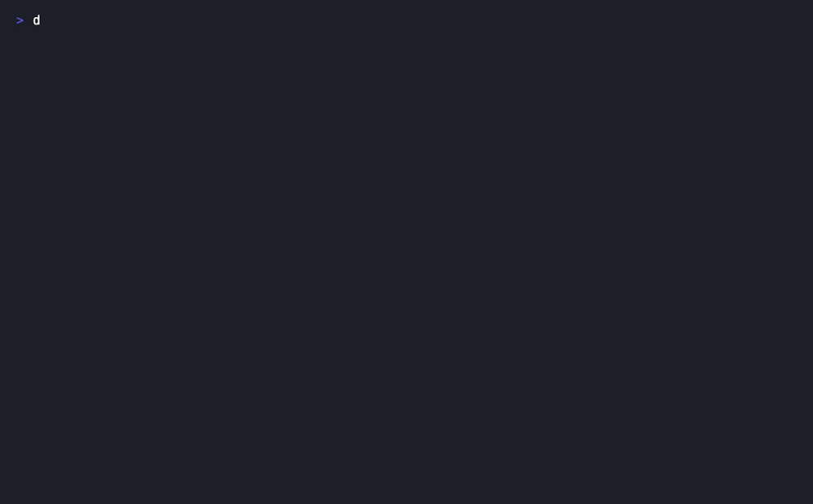

[English](./README.en.md) | **简体中文**

<div align="center">


# DraftProof

**本地签名的写作过程存证：每次保存进入 ed25519 哈希链，被 AIGC 检测误判时，递出一份可离线验签的写作过程回执。**

[](https://github.com/SuperMarioYL/draftproof/actions/workflows/ci.yml)
[](https://github.com/SuperMarioYL/draftproof/releases)
[](https://go.dev/)
[](./LICENSE)
[](https://github.com/SuperMarioYL/draftproof/releases)


<picture>
  <source media="(max-width: 640px) and (prefers-color-scheme: dark)" srcset="assets/presentation/hero-mobile-dark.svg">
  <source media="(max-width: 640px)" srcset="assets/presentation/hero-mobile-light.svg">
  <source media="(prefers-color-scheme: dark)" srcset="assets/presentation/hero-dark.svg">
  
</picture>

</div>

---

humanizer 用 47k star 证明了作者有多怕被 AI 检测误判，但它只教你藏。DraftProof 反其道而行：把写作过程本身变成密码学可验的证据。

##  为什么是 DraftProof

知网/维普等 AIGC 检测已是学位论文与期刊投稿的强制关卡，一个概率分就可能卡住答辩或发表——而「这篇论文是我自己写的」在检测报告面前无法自证。检测器看到的是**终稿文本**，永远看不到**写作过程**；humanizer 式工具改写文本，规避 scrutiny 的同时什么也证明不了。

DraftProof 补上中间缺失的一层：**provenance（过程存证）**。

- **写之前**：`draftproof init` 生成 ed25519 密钥并输出密钥卡，公钥指纹当天发给导师留档——事后换钥匙重造的链，对不上事前登记的指纹。
- **写作期间**：`draftproof watch ~/thesis` 常驻后台，任何编辑器（Word/WPS/Typora/VS Code）的每次保存自动追加一条签名快照，草稿一个字节都不出本机，写作零感知。
- **被误判当天**：`draftproof export` 导出 `receipt-*.dpb` 回执包 + 一页可打印的写作时间线 HTML。
- **裁决侧**：学位办/期刊编辑部收到 .dpb 后，用同一二进制离线运行 `draftproof verify`——PASS 即整链未被篡改；改动任何一个快照、时间戳甚至一个哈希字符，立即 FAIL 并定位断点。

如实说明边界：回执证明的是**写作过程存在、且导出后未被篡改**，不证明「没有使用 AI」——AI 协作会话在 Agent Skill 模式下会被如实标记（见[申诉材料包](#-申诉材料包m3-预览)）。取证工具必须免费才可信：作者端 CLI 与回执永久免费开源，商业化在裁决侧（见[定价](#-定价)）。

##  架构

<picture>
  <source media="(max-width: 640px) and (prefers-color-scheme: dark)" srcset="assets/presentation/architecture-mobile-dark.svg">
  <source media="(max-width: 640px)" srcset="assets/presentation/architecture-mobile-light.svg">
  <source media="(prefers-color-scheme: dark)" srcset="assets/presentation/architecture-dark.svg">
  
</picture>

单进程、单二进制、零网络、零服务端。快照按**字节哈希**记录，不解析文档格式——docx/md/tex 一视同仁；`.draftproof/chain.jsonl` 只追加、不重写，插入/删除/重排都会断链。

源码入口：[cmd/watch.go](cmd/watch.go) · [cmd/export.go](cmd/export.go) · [cmd/verify.go](cmd/verify.go) · [internal/chain/chain.go](internal/chain/chain.go) · [internal/store/store.go](internal/store/store.go) · [internal/report/report.go](internal/report/report.go) · [internal/report/receipt.html](internal/report/receipt.html)

##  快速开始

需要 Go 1.24+（或从 [Release](https://github.com/SuperMarioYL/draftproof/releases) 下载 Windows/macOS/Linux 单文件二进制，goreleaser 产物附 sha256）。

```bash
git clone https://github.com/SuperMarioYL/draftproof.git
cd draftproof
go build -o bin/draftproof .
```

先在临时目录跑通「篡改即翻红」全流程（隔离 HOME，不触碰真实密钥与论文）：

```bash
DRAFTPROOF=bin/draftproof python3 examples/demo-tamper-reject.py
```

然后挂到你自己的论文目录：

```bash
draftproof init              # 生成密钥 + 密钥卡（指纹当天发导师留档）
draftproof watch ~/thesis    # 常驻后台，写作期间零感知
# ……正常写作、正常保存……
draftproof log ~/thesis      # 随时查看写作时间线
draftproof export ~/thesis   # 需要申诉时：导出 .dpb + 可打印 HTML
draftproof verify receipt-*.dpb   # 学位办侧：离线复核，零安装零联网
```

以上五条命令就是 v0.1 的全部接口。`examples/demo-tamper-reject.py` 会自动创建一份示例论文（`thesis.md`，四版保存），无需准备任何输入。

##  实际 Demo

下面的命令与输出复制自 2026-09-13 的一次真实运行（v0.1.0，全程离线），完整记录见 [docs/demo-results.json](docs/demo-results.json)。演示用 `--debounce 700ms` 加速，日常默认 5 秒防抖。



录制脚本：[docs/demo.tape](docs/demo.tape)（vhs，可用 [.github/workflows/demo.yml](.github/workflows/demo.yml) 重新渲染）。

### 写作被逐次捕获

```text
[draftproof] watch /tmp/draftproof-demo-s89dd1pe/thesis — 追踪 .docx/.md/.tex（任何编辑器的保存都会被捕获）
[draftproof] 存证库 /tmp/draftproof-demo-s89dd1pe/thesis/.draftproof · 防抖 700ms · 作者指纹 sha256:3f088bb31a8c…
[draftproof] 已有快照 0 个（0 个文档）；Ctrl-C 结束
[draftproof] 捕获 thesis.md #1  71B  sha256:aee4d0ad8a0c…
[draftproof] 捕获 thesis.md #2  110B  sha256:d2c00340d85f…
[draftproof] 捕获 thesis.md #3  168B  sha256:bbcc21a62bc6…
[draftproof] 捕获 thesis.md #4  204B  sha256:4ecc37485d74…
[draftproof] 结束：本次新增 4 个快照，存证库 /tmp/draftproof-demo-s89dd1pe/thesis/.draftproof
```

### 学位办复核：未动 → PASS

```text
$ draftproof verify /tmp/draftproof-demo-s89dd1pe/receipt-20260913-105712.dpb
回执 /tmp/draftproof-demo-s89dd1pe/receipt-20260913-105712.dpb
  文档     thesis.md（doc ce99f4e9a819…）
  作者     公钥指纹 sha256:3f088bb31a8c55b7d7bbff21dfd584f0c8a7e0b2cd8653be8667d7ae49ee5913
  范围     4 个快照 · 2026-09-13 10:53 → 2026-09-13 10:53（完整链）
  会话     1 个 · 跨度 3s · 累计增量 204 B
  签名     4/4 个快照 ed25519 签名有效
  哈希链   3/3 个链接逐环匹配
  回执签名 有效（覆盖全部快照与会话统计）
PASS 整链未被篡改
复核提示：与作者事前预登记的密钥卡指纹比对 sha256:3f088bb31a8c…
```

### 篡改一个快照 → FAIL + 断点定位

把 seq 2 的 `content_hash` 改掉 8 个十六进制字符（`python3 examples/tamper-receipt.py`），再验一次：

```text
$ draftproof verify /tmp/draftproof-demo-s89dd1pe/receipt-20260913-105712.dpb
回执 /tmp/draftproof-demo-s89dd1pe/receipt-20260913-105712.dpb
  文档     thesis.md（doc ce99f4e9a819…）
  作者     公钥指纹 sha256:3f088bb31a8c55b7d7bbff21dfd584f0c8a7e0b2cd8653be8667d7ae49ee5913
  范围     4 个快照 · 2026-09-13 10:53 → 2026-09-13 10:53（完整链）
  会话     1 个 · 跨度 3s · 累计增量 204 B
FAIL 检测到篡改
  问题 回执整体：回执级 ed25519 签名无效——导出后有人改动过包内内容
  问题 快照 #2（seq 2）: ed25519 签名无效（记录被修改，或非作者密钥）
  问题 快照 #3（seq 3）: prev_hash 与上一快照的记录哈希不匹配——上一条记录被改动
复核建议：向作者索取原始 .dpb；比对预登记密钥卡指纹 sha256:3f088bb31a8c…
```

<picture>
  <source media="(prefers-color-scheme: dark)" srcset="assets/presentation/demo-0-dark.svg">
  
</picture>

##  数据模型与信任边界

每次保存是一条 **Snapshot**：`seq`（单文档单调递增）、`saved_at`（墙钟）+ `mono_nanos`（单调时钟，回拨可见）、`prev_hash`（链向上一条记录的 sha256）、`content_hash`（文件字节哈希——**不存正文**）、`size`、`sig`（作者私钥对以上全部字段的 ed25519 签名）。回执 **Receipt** 再由作者密钥整体签名，把快照、会话分布与统计封进一个自包含的 `.dpb`。

<picture>
  <source media="(max-width: 640px) and (prefers-color-scheme: dark)" srcset="assets/presentation/process-mobile-dark.svg">
  <source media="(max-width: 640px)" srcset="assets/presentation/process-mobile-light.svg">
  <source media="(prefers-color-scheme: dark)" srcset="assets/presentation/process-dark.svg">
  
</picture>

诚实的设计取舍（写在产品里，而不是藏在 FAQ）：

- **本地时间戳防不了「换钥匙整链重造」**——所以 `init` 即出密钥卡，要求写作当天就把指纹发给导师/同学留档。回执与密钥卡指纹对不上，存证即失效。
- **PASS ≠ 没用 AI**——回执证明过程存在且未篡改；AI 协作会话应被如实标记，检测方拿到的是更可信的输入，不是洗白工具。
- **docx 等压缩容器按字节哈希、不解析内部**——.md/.tex 纯文本草稿的逐版可读 diff 不在 v0.1 范围。
- **单机单作者**：多设备同步、团队签名、移动端、浏览器扩展都不在 v0.1。

<picture>
  <source media="(max-width: 640px) and (prefers-color-scheme: dark)" srcset="assets/presentation/integrations-mobile-dark.svg">
  <source media="(max-width: 640px)" srcset="assets/presentation/integrations-mobile-light.svg">
  <source media="(prefers-color-scheme: dark)" srcset="assets/presentation/integrations-dark.svg">
  
</picture>

明确不在 v0.1 的方向：编辑器插件（文件夹级 watch 已覆盖任何编辑器）、云端备份 / RFC 3161 远程时间戳 / 区块链锚定（未发表草稿不许上云）、AI 痕迹消除或改写（DraftProof 是 humanizer 的反面：只记录，不改写一个字）、Web UI、知网/维普 API 对接或自动申诉。

##  申诉材料包（m3 预览）

回执是证据，递交申诉仍是人的动作。中文申诉材料模板与 provenance Agent Skill 正在 m3 里程碑开发中，当前仓库内为**草稿预览**，未在国产模型 agent 宿主上验证：

- [skill/SKILL.md](skill/SKILL.md) — humanizer 同格式的 provenance Agent Skill（草稿）
- [docs/appeal_kit_zh.md](docs/appeal_kit_zh.md) — 回执如何附进申诉信的中文模板（草稿）

##  定价

作者端 CLI、回执教验与导出**永久免费开源**——取证工具免费才可信，且每个申诉作者都是标准的推销员。商业化在**裁决侧**：

| 方案 | 对象 | 价格 | 内容 |
| --- | --- | --- | --- |
| 作者端 CLI（本仓库） | 被误判的论文作者 | 免费 · MIT | init / watch / log / export / verify 全功能 |
| 院校版验签工作站（v0.2+） | 学位办 / 院系 | ¥19,800 / 院系 / 年 | 气隙部署、批量验签 .dpb、回执归档检索、复核意见单模板输出，数据不出校 |
| 期刊编辑部版（v0.2+） | 期刊编辑部 | ¥6,800 / 单刊 / 年 | 同上，按单刊授权 |
| 首家试点 | 访谈院校 | ¥9,800 一次性 | 换落地案例与联合署名 |

工作站采用离线 license 文件 + 对公转账 + 增值税发票（非 SaaS 计费），起步无需云计费栈。v0.1 阶段（当前）工作站尚未发布；如果你在学位办或期刊编辑部、正被 AIGC 检测争议困扰，欢迎开 issue 联系——第一批试点用户将参与定义复核意见单的格式。

##  路线图

- **v0.1（当前，m1+m2 完成）**：init 密钥与密钥卡、watch 签名快照捕获、log 写作时间线、export `.dpb` + 可打印 HTML 回执、verify 离线复核与断点定位；篡改即翻红演示已录制。
- **v0.1.x（m3，进行中）**：provenance Agent Skill 在国产模型宿主（Qwen/GLM/DeepSeek 生态）上的验证与打磨、中文申诉材料包定稿、Gitee 镜像。
- **v0.2+**：院校版离线验签工作站（批量验签、归档检索、复核意见单、气隙部署）。
- **长期评估中**：RFC 3161 远程时间戳锚定（仅在「不上传草稿内容、只锚定哈希」的前提下）。

##  许可证

[MIT](./LICENSE) · 图标来自 [Tabler Icons](https://tabler.io)（MIT）。

<p align="center"><sub><a href="./LICENSE">MIT</a> © 2026 SuperMarioYL</sub></p>
